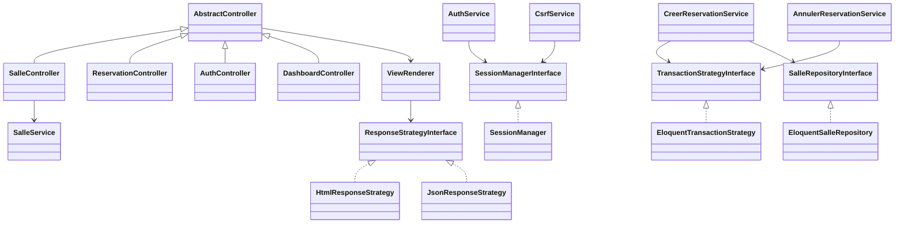

# Analyse Architecturale du Projet — Gestion des Réservations de Salles

Ce document formalise l'architecture logicielle de l'application de réservation de salles universitaires développée dans le cadre du projet **ODC-P8**. Il décortique les 14 concepts fondamentaux requis, fournit des extraits concrets issus de notre implémentation et compile les réponses aux questions techniques posées à chaque étape du projet.

---

## Sommaire
1. [Diagramme Global des Classes](#diagramme-global-des-classes)
2. [Analyse Détaillée des 14 Notions Architecturales](#analyse-détaillée-des-14-notions-architecturales)
   - 1. MVC (Modèle - Vue - Contrôleur)
   - 2. Front Controller
   - 3. Router
   - 4. Validator
   - 5. DTO (Data Transfer Object)
   - 6. ORM (Object-Relational Mapping)
   - 7. Active Record
   - 8. Repository
   - 9. Service (Couche Métier)
   - 10. Injection par Constructeur
   - 11. Conteneur d'Injection de Dépendances
   - 12. Autowiring
   - 13. Inversion de Contrôle (IoC)
   - 14. Les Cinq Principes SOLID
3. [Réponses Consolidées aux Questions Pédagogiques (Étapes 1 à 11)](#réponses-consolidées-aux-questions-pédagogiques)

---

## Diagramme Global des Classes

```mermaid
classDiagram
    direction TB

    class Application {
        -Dispatcher dispatcher
        -ContainerInterface container
        -ViewRenderer view
        +run() void
    }

    class SalleController {
        -SalleRepositoryInterface salles
        -SalleValidator validator
        -ViewRenderer view
        +index() string
        +show(int id) string
        +create() string
        +store() string
        +edit(int id) string
        +update(int id) string
    }

    class ReservationController {
        -ReservationRepositoryInterface reservations
        -SalleRepositoryInterface salles
        -ReservationValidator validator
        -CreerReservationService creerReservationService
        -AnnulerReservationService annulerReservationService
        -ViewRenderer view
        +index() string
        +show(int id) string
        +create() string
        +store() string
        +cancel(int id) void
    }

    class SalleRepositoryInterface {
        <<interface>>
        +all() array
        +findById(int id) ?Salle
        +save(Salle salle) bool
        +setActif(int id, bool active) bool
    }

    class ReservationRepositoryInterface {
        <<interface>>
        +all() array
        +findBySalle(int salleId) array
        +findById(int id) ?Reservation
        +save(Reservation reservation) bool
        +annuler(int id) bool
        +trouverConflit(int salleId, DateTimeInterface debut, DateTimeInterface fin, ?int exclureId) ?Reservation
    }

    class EloquentSalleRepository {
        +all() array
        +findById(int id) ?Salle
        +save(Salle salle) bool
        +setActif(int id, bool active) bool
    }

    class EloquentReservationRepository {
        +all() array
        +findBySalle(int salleId) array
        +findById(int id) ?Reservation
        +save(Reservation reservation) bool
        +annuler(int id) bool
        +trouverConflit(int salleId, DateTimeInterface debut, DateTimeInterface fin, ?int exclureId) ?Reservation
    }

    class CreerReservationService {
        -SalleRepositoryInterface salles
        -ReservationRepositoryInterface reservations
        +execute(CreerReservationDTO dto) Reservation
    }

    class AnnulerReservationService {
        -ReservationRepositoryInterface reservations
        +execute(int reservationId) bool
    }

    class ValidatorInterface {
        <<interface>>
        +validate(array data) ValidationResult
    }

    class SalleValidator {
        +validate(array data) ValidationResult
    }

    class ReservationValidator {
        +validate(array data) ValidationResult
    }

    class ValidationResult {
        -bool valid
        -array errors
        -array data
        +isValid() bool
        +errors() array
        +error(string field) ?string
        +validated() array
    }

    class CreerReservationDTO {
        +int salleId
        +string responsable
        +string email
        +string motif
        +DateTimeImmutable dateDebut
        +DateTimeImmutable dateFin
        +fromArray(array data)$ CreerReservationDTO
    }

    class CreerSalleDTO {
        +string nom
        +string batiment
        +int capacite
        +string type
        +bool active
        +fromArray(array data)$ CreerSalleDTO
    }

    class Salle {
        +int id
        +string nom
        +string batiment
        +int capacite
        +string type
        +bool active
        +reservations() HasMany
    }

    class Reservation {
        +int id
        +int salle_id
        +string responsable
        +string email
        +string motif
        +DateTime date_debut
        +DateTime date_fin
        +string statut
        +salle() BelongsTo
    }

    SalleRepositoryInterface <|.. EloquentSalleRepository
    ReservationRepositoryInterface <|.. EloquentReservationRepository

    ValidatorInterface <|.. SalleValidator
    ValidatorInterface <|.. ReservationValidator

    SalleController --> SalleRepositoryInterface
    SalleController --> SalleValidator

    ReservationController --> ReservationRepositoryInterface
    ReservationController --> SalleRepositoryInterface
    ReservationController --> ReservationValidator
    ReservationController --> CreerReservationService
    ReservationController --> AnnulerReservationService

    CreerReservationService --> SalleRepositoryInterface
    CreerReservationService --> ReservationRepositoryInterface
    CreerReservationService ..> CreerReservationDTO
    CreerReservationService ..> Reservation

    Salle "1" *-- "0..*" Reservation : reservations
```



---

## Analyse Détaillée des 14 Notions Architecturales

### 1. MVC (Modèle - Vue - Contrôleur)
1. **Classes concernées** : `App\Model\Salle`, `App\Model\Reservation` (Modèle) ; `App\View\ViewRenderer`, `templates/**/*.php` (Vue) ; `App\Controller\SalleController`, `App\Controller\ReservationController` (Contrôleur).
2. **Rôle** : Séparer l'application en trois responsabilités distinctes : les données et leur persistance (M), l'affichage utilisateur (V) et l'orchestration des flux de requêtes HTTP (C).
3. **Avantage** : Évite le code spaghetti en séparant la logique de présentation de la logique applicative ; permet de modifier l'interface visuelle sans impacter les données.
4. **Limite / Risque** : Risque de "Fat Controller" si le développeur dépose la logique métier dans le contrôleur au lieu d'une couche Service dédiée.
5. **Extrait représentatif** :
```php
// App\Controller\ReservationController::show()
public function show(int $id): string
{
    $reservation = $this->reservations->findById($id);
    if ($reservation === null) {
        http_response_code(404);
        return $this->view->render('error/404', ['title' => 'Réservation introuvable']);
    }

    return $this->view->render('reservation/show', [
        'title'       => 'Réservation #' . $reservation->id,
        'reservation' => $reservation,
    ]);
}
```

---

### 2. Front Controller
1. **Classes / Fichiers concernés** : `public/index.php`, `App\Application`.
2. **Rôle** : Point d'entrée unique de toutes les requêtes HTTP de l'application web. Il initialise l'environnement, configure le conteneur DI et délègue le traitement au routeur.
3. **Avantage** : Centralise les opérations transversales (amorçage, sessions, gestion d'erreurs globales 500, sécurité HTTP).
4. **Limite / Risque** : Peut devenir un point de défaillance unique ou un goulot d'étranglement si trop de traitements synchrones y sont greffés.
5. **Extrait représentatif** :
```php
// public/index.php
$builder = new ContainerBuilder();
$builder->addDefinitions(dirname(__DIR__) . '/config/container.php');
$container = $builder->build();

$application = $container->get(Application::class);
$application->run();
```

---

### 3. Router
1. **Classes / Fichiers concernés** : `routes/web.php`, `FastRoute\Dispatcher`, `App\Application`.
2. **Rôle** : Analyser l'URL demandée et la méthode HTTP afin d'associer la requête à un contrôleur et une action spécifique, tout en extrayant les paramètres dynamiques.
3. **Avantage** : Découple complètement l'organisation physique des fichiers du serveur web des URLs publiques ; gère nativement les erreurs 404 (non trouvé) et 405 (méthode non autorisée).
4. **Limite / Risque** : Nécessite une configuration serveur de réécriture (`mod_rewrite` ou `try_files`) pour router tout le trafic vers `public/index.php`.
5. **Extrait représentatif** :
```php
// routes/web.php
$r->addRoute('GET', '/reservations/{id:\d+}', [ReservationController::class, 'show']);
$r->addRoute('POST', '/reservations/{id:\d+}/cancel', [ReservationController::class, 'cancel']);
```

---

### 4. Validator
1. **Classes concernées** : `App\Validation\ValidatorInterface`, `App\Validation\SalleValidator`, `App\Validation\ReservationValidator`, `App\Validation\ValidationResult`.
2. **Rôle** : Vérifier la conformité syntaxique et structurelle des données brutes reçues en entrée (formats, types, longueurs, obligatoires) avant transmission aux couches internes.
3. **Avantage** : Protège le cœur de l'application contre les données corrompues et produit des messages d'erreur ciblés champ par champ pour l'utilisateur.
4. **Limite / Risque** : Ne doit pas valider les règles métier contextuelles (disponibilité, chevauchement), sous peine de créer un couplage avec la base de données.
5. **Extrait représentatif** :
```php
// App\Validation\ReservationValidator.php
if (!v::email()->validate($email)) {
    $errors['email'] = "L'adresse électronique est invalide.";
}
if (!v::stringType()->length(5, 255)->validate($motif)) {
    $errors['motif'] = "Le motif doit contenir entre 5 et 255 caractères.";
}
return new ValidationResult(empty($errors), $errors, $validatedData);
```

---

### 5. DTO (Data Transfer Object)
1. **Classes concernées** : `App\DTO\CreerReservationDTO`, `App\DTO\CreerSalleDTO`.
2. **Rôle** : Objet pur en lecture seule transportant des données typées et validées d'une couche à une autre (du Contrôleur vers le Service).
3. **Avantage** : Élimine la manipulation directe de tableaux associatifs faiblement typés (`$_POST`) et fournit un contrat strict vérifiable par l'analyseur statique et l'IDE.
4. **Limite / Risque** : Multiplie les classes pour des cas très simples si le modèle est trivial.
5. **Extrait représentatif** :
```php
// App\DTO\CreerReservationDTO.php
final class CreerReservationDTO
{
    public function __construct(
        public readonly int $salleId,
        public readonly string $responsable,
        public readonly string $email,
        public readonly string $motif,
        public readonly DateTimeImmutable $dateDebut,
        public readonly DateTimeImmutable $dateFin
    ) {}
}
```

---

### 6. ORM (Object-Relational Mapping)
1. **Classes concernées** : `Illuminate\Database\Capsule\Manager`, `Illuminate\Database\Eloquent\Model`.
2. **Rôle** : Établir une passerelle d'abstraction entre les tables relationnelles SQL (MySQL) et le modèle objet de PHP.
3. **Avantage** : Évite d'écrire des requêtes SQL répétitives à la main, automatise l'hydratation des entités et gère les types et les relations.
4. **Limite / Risque** : Perte potentielle de performance sur des requêtes très complexes ou volumineuses (problème des requêtes N+1 si non anticipé avec `with()`).
5. **Extrait représentatif** :
```php
// config/database.php
$capsule = new Capsule();
$capsule->addConnection([
    'driver'    => $_ENV['DB_DRIVER'] ?? 'mysql',
    'database'  => $_ENV['DB_DATABASE'] ?? 'reservation_salles',
    // ...
]);
$capsule->bootEloquent();
```

---

### 7. Active Record
1. **Classes concernées** : `App\Model\Salle`, `App\Model\Reservation` (qui héritent de `Illuminate\Database\Eloquent\Model`).
2. **Rôle** : Patron de conception où chaque instance d'une classe encapsule à la fois une ligne de table de base de données et les opérations de persistance associées (`$salle->save()`).
3. **Avantage** : API intuitive et très rapide à utiliser pour les manipulations courantes (CRUD, relations directes).
4. **Limite / Risque** : Viole le principe de responsabilité unique (SRP) car l'entité mélange données métier et persistance BDD. D'où l'isolation derrière un Repository.
5. **Extrait représentatif** :
```php
// App\Model\Salle.php
class Salle extends Model
{
    protected $table = 'salles';
    protected $fillable = ['nom', 'batiment', 'capacite', 'type', 'active'];
    protected $casts = ['capacite' => 'integer', 'active' => 'boolean'];
}
```

---

### 8. Repository
1. **Classes concernées** : `App\Repository\SalleRepositoryInterface`, `App\Repository\ReservationRepositoryInterface`, `App\Repository\EloquentSalleRepository`, `App\Repository\EloquentReservationRepository`.
2. **Rôle** : Servir de couche de médiation entre le domaine métier et la couche de stockage des données, en simulant une collection d'objets en mémoire.
3. **Avantage** : Isole la persistance : si l'on change d'ORM ou de moteur de stockage, seul le repository change, sans impacter la logique métier.
4. **Limite / Risque** : Peut introduire une surcharge de code lorsqu'un ORM Active Record est déjà présent, mais demeure essentiel pour tester unitairement sans base de données.
5. **Extrait représentatif** :
```php
// App\Repository\EloquentReservationRepository.php
public function trouverConflit(int $salleId, DateTimeInterface $debut, DateTimeInterface $fin, ?int $exclureId = null): ?Reservation
{
    $query = Reservation::where('salle_id', $salleId)
        ->where('statut', 'confirmée')
        ->where('date_debut', '<', $fin->format('Y-m-d H:i:s'))
        ->where('date_fin', '>', $debut->format('Y-m-d H:i:s'));

    if ($exclureId !== null) {
        $query->where('id', '!=', $exclureId);
    }

    return $query->first();
}
```

---

### 9. Service (Couche Métier)
1. **Classes concernées** : `App\Service\CreerReservationService`, `App\Service\AnnulerReservationService`.
2. **Rôle** : Contenir l'ensemble des règles de gestion pures du domaine (non-chevauchement, durée maximale, salle active, date future) indépendantes de tout protocole HTTP ou stockage technique.
3. **Avantage** : Réutilisable indifféremment depuis un contrôleur web, une commande CLI ou une API sans duplication de logique.
4. **Limite / Risque** : Risque d'anémie de domaine si les services deviennent de simples passe-plats sans règles substantielles.
5. **Extrait représentatif** :
```php
// App\Service\CreerReservationService.php
// 4. Vérifier que la durée ne dépasse pas 4 heures
$dureeSecondes = $dto->dateFin->getTimestamp() - $dto->dateDebut->getTimestamp();
if ($dureeSecondes > (4 * 3600)) {
    throw new SalleIndisponibleException("Une réservation ne peut pas dépasser quatre heures.");
}
// 6. Rechercher les chevauchements
$conflit = $this->reservations->trouverConflit($dto->salleId, $dto->dateDebut, $dto->dateFin);
if ($conflit !== null) {
    throw new SalleIndisponibleException("La salle est indisponible pendant cette période.");
}
```

---

### 10. Injection par Constructeur (Constructor Injection)
1. **Classes concernées** : Tous les services et contrôleurs (`CreerReservationService`, `SalleController`, `ReservationController`, etc.).
2. **Rôle** : Fournir toutes les dépendances requises par une classe au moment exact de son instanciation via son constructeur `__construct()`.
3. **Avantage** : Rend la classe immuable, garantit qu'elle ne peut pas exister dans un état incomplet, et rend ses dépendances explicites et facilement substituables lors des tests.
4. **Limite / Risque** : Un trop grand nombre d'arguments dans le constructeur ("Constructor Over-injection") indique généralement une violation du principe SRP.
5. **Extrait représentatif** :
```php
// App\Service\CreerReservationService.php
public function __construct(
    private readonly SalleRepositoryInterface $salles,
    private readonly ReservationRepositoryInterface $reservations
) {}
```

---

### 11. Conteneur d'Injection de Dépendances (DI Container)
1. **Classes / Fichiers concernés** : `config/container.php`, `public/index.php`, `DI\ContainerBuilder`.
2. **Rôle** : Centraliser la création, la configuration et l'assemblage de toutes les instances d'objets de l'application.
3. **Avantage** : Supprime le code d'instanciation dispersé (`new ClassA(new ClassB(...))`) et applique la configuration de manière centralisée.
4. **Limite / Risque** : Ne doit pas être transformé en "Service Locator" en l'injectant dans les services métiers.
5. **Extrait représentatif** :
```php
// config/container.php
return [
    SalleRepositoryInterface::class => factory(fn() => new EloquentSalleRepository()),
    ReservationRepositoryInterface::class => factory(fn() => new EloquentReservationRepository()),
    CreerReservationService::class => autowire(CreerReservationService::class),
];
```

---

### 12. Autowiring
1. **Classes concernées** : `config/container.php`, PHP-DI (`DI\autowire`).
2. **Rôle** : Mécanisme par lequel le conteneur inspecte par réflexion les paramètres typés des constructeurs pour instancier et injecter automatiquement les dépendances adéquates.
3. **Avantage** : Évite d'écrire manuellement des lignes de configuration pour chaque nouvelle classe concrète.
4. **Limite / Risque** : L'autowiring ne peut pas deviner quelle classe concrète instancier pour une interface sans une définition explicite préalable.
5. **Extrait représentatif** :
```php
// config/container.php
// PHP-DI injecte automatiquement les interfaces SalleRepositoryInterface et ReservationRepositoryInterface
CreerReservationService::class => autowire(CreerReservationService::class),
```

---

### 13. Inversion de Contrôle (IoC)
1. **Classes concernées** : L'ensemble de l'architecture : `Application`, `ContainerBuilder`, interfaces de repositories.
2. **Rôle** : Principe où le flot d'exécution n'est plus dirigé par le code métier instanciant ses dépendances, mais par une infrastructure externe (le conteneur et le routeur) qui appelle le code métier.
3. **Avantage** : Découplage maximal entre composants de haut niveau et modules de bas niveau.
4. **Limite / Risque** : Augmentation du niveau d'abstraction rendant la compréhension du cheminement d'exécution moins direct à la première lecture.
5. **Extrait représentatif** :
```php
// App\Application.php
// Ce n'est pas le contrôleur qui s'exécute lui-même, c'est l'Application qui l'invoque via le conteneur :
$controller = $this->container->get($controllerClass);
$response = $controller->$method(...array_values($vars));
```

---

### 14. Les Cinq Principes SOLID

#### S — Single Responsibility Principle (Responsabilité Unique)
- **Application dans le projet** : Chaque classe a une unique raison de changer : `SalleValidator` ne fait que vérifier la syntaxe, `CreerReservationDTO` ne fait que transporter la donnée, `CreerReservationService` n'applique que les règles métier, `EloquentSalleRepository` ne gère que la persistance.

#### O — Open/Closed Principle (Ouvert à l'extension, fermé à la modification)
- **Application dans le projet** : L'ajout d'une nouvelle implémentation de stockage (ex: `InMemoryReservationRepository` ou `MongoReservationRepository`) se fait sans modifier une seule ligne du service métier `CreerReservationService`.

#### L — Liskov Substitution Principle (Substitution de Liskov)
- **Application dans le projet** : `InMemoryReservationRepository` se substitue parfaitement à `EloquentReservationRepository` dans `CreerReservationService` durant les tests unitaires sans altérer le comportement attendu.

#### I — Interface Segregation Principle (Ségrégation des Interfaces)
- **Application dans le projet** : Les contrats sont scindés et spécialisés : `SalleRepositoryInterface` ne force pas à manipuler des réservations, et `ValidatorInterface` expose uniquement la méthode `validate(array $data)`.

#### D — Dependency Inversion Principle (Inversion des Dépendances)
- **Application dans le projet** : Les services de haut niveau dépendent d'abstractions (`SalleRepositoryInterface`) et non d'implémentations concrètes de bas niveau (`EloquentSalleRepository`).

---

## Réponses Consolidées aux Questions Pédagogiques

### Étape 1 — Initialiser le projet Composer
1. **Quel est le rôle de Composer ?**
   Composer est le gestionnaire de dépendances standard de l'écosystème PHP. Il résout les dépendances récursives de bibliothèques tierces, télécharge leurs archives, génère un chargeur automatique conforme aux normes PSR (PSR-4), et verrouille les versions exactes dans `composer.lock`.
2. **Quelle différence existe entre require et require-dev ?**
   `require` regroupe les bibliothèques indispensables au fonctionnement de l'application en production (`fast-route`, `eloquent`, `php-di`), tandis que `require-dev` isole les outils nécessaires uniquement au développement et aux tests (`phpunit`). En production, `composer install --no-dev` exclut ces paquets.
3. **Pourquoi faut-il versionner composer.lock ?**
   `composer.lock` enregistre l'empreinte et les versions exactes (au commit/tag près) de chaque paquet installé. Son versionnement garantit une reproductibilité absolue des environnements entre développeurs, serveurs de CI/CD et production.
4. **Pourquoi ne versionne-t-on pas vendor/ ?**
   Le dossier `vendor/` contient des dizaines de milliers de fichiers de code tiers téléchargés. Le versionner alourdirait inutilement le dépôt Git, rendrait les diffs illisibles, et créerait des conflits de fusion ingérables. `composer.json` et `composer.lock` suffisent à reconstituer `vendor/`.

### Étape 2 — Configurer Eloquent
1. **Quel rôle joue Capsule\Manager ?**
   `Capsule\Manager` est un adaptateur fourni par `illuminate/database` permettant d'initialiser, de configurer et d'amorcer Eloquent en dehors de l'infrastructure d'un framework Laravel complet.
2. **Pourquoi Eloquent peut-il fonctionner sans Laravel ?**
   Les composants Illuminate de Laravel sont conçus sous forme de paquetages autonomes et modulaires (« decoupled components »). `illuminate/database` intègre son propre conteneur minimal pour fonctionner de manière autonome.
3. **Où doit se trouver le démarrage de l'ORM ?**
   Le démarrage de l'ORM doit être confiné dans la phase d'amorçage (bootstrap) de l'application (`config/database.php` ou factory du conteneur DI), et ne doit jamais être réexécuté dans les classes métier.
4. **Quelle différence existe entre ORM et SQL écrit à la main ?**
   Le SQL à la main offre un contrôle absolu mais implique une gestion manuelle fastidieuse du mapping résultats-objets et un risque accru d'injections SQL si mal préparé. L'ORM automatise l'hydratation objet, gère les relations, abstrait la dialecte SQL et sécurise nativement les requêtes paramétrées.

### Étape 3 — Créer les modèles
1. **Quel type de relation Eloquent avez-vous utilisé ?**
   Une relation `One-to-Many` (Un-à-Plusieurs) : `hasMany` depuis `Salle` vers `Reservation`, et la relation inverse `belongsTo` depuis `Reservation` vers `Salle`.
2. **Pourquoi déclarer $fillable ou $guarded ?**
   C'est un mécanisme de sécurité contre les attaques par assignation de masse (« Mass Assignment »). `$fillable` spécifie explicitement une liste blanche des colonnes modifiables lors d'un `create()` ou `update()`.
3. **Pourquoi convertir active en booléen ?**
   En base de données MySQL, les booléens sont stockés sous forme de `TINYINT(1)`. La conversion (`$casts = ['active' => 'boolean']`) garantit que PHP manipule un type primitif `bool` (`true`/`false`) strict.
4. **Pourquoi convertir les dates en objets ?**
   Manipuler des instances `DateTime` ou `Carbon` au lieu de simples chaînes permet d'effectuer des comparaisons fiables, des calculs de durées et des formatages personnalisés sans conversion manuelle récurrente.

### Étape 4 — Données initiales
1. **Quelle différence existe entre migration et seeder ?**
   La migration définit et fait évoluer la structure (DDL : tables, colonnes, index), tandis que le seeder peuple la base avec des données de référence ou de démonstration (DML).
2. **Pourquoi les données initiales doivent-elles être reproductibles ?**
   Elles permettent à tout nouvel arrivant ou à la chaîne d'intégration continue d'initialiser un environnement de travail fonctionnel en une commande.
3. **Comment empêcher les doublons ?**
   En employant des clauses conditionnelles d'existence comme `updateOrCreate(['nom' => $data['nom']], $data)` ou `firstOrCreate`, indexées sur un champ d'identification métier unique.

### Étape 5 — Créer la validation
1. **Pourquoi séparer la validation syntaxique des règles métier ?**
   La validation syntaxique vérifie le format intrinsèque de la donnée reçue sans dépendre du contexte ni de la base (ex: email valide). La règle métier vérifie la cohérence dans le domaine (ex: la salle est-elle libre à cette heure ?). Séparer ces deux logiques évite de polluer le domaine avec des vérifications de chaînes.
2. **Pourquoi créer une interface de validation ?**
   Elle définit un contrat standardisé (`ValidatorInterface`) permettant au contrôleur d'exécuter n'importe quel validateur de manière polymorphique et découplée.
3. **Pourquoi le validateur ne doit-il pas enregistrer les données ?**
   Le validateur a pour unique responsabilité de statuer sur la conformité de l'entrée. Persister des données violerait le principe de responsabilité unique (SRP).
4. **Comment retourner plusieurs erreurs en une seule fois ?**
   En agrégeant un tableau associatif clé-valeur (`[champ => message]`) dans un objet résultat (`ValidationResult`), permettant d'afficher toutes les erreurs simultanément sous chaque champ du formulaire.

### Étape 6 — Objets de transport (DTO)
1. **Quelle différence existe entre DTO et modèle Eloquent ?**
   Un DTO est une structure de données pure (sans comportement ni persistance) servant à passer des paramètres typés entre couches. Le modèle Eloquent est une entité Active Record liée à la base de données possédant des méthodes de persistance et des relations.
2. **Pourquoi le DTO ne doit-il pas appeler save() ?**
   Un DTO n'est qu'un messager. Lui donner la responsabilité de persister détruirait la séparation des responsabilités.
3. **À quel moment transforme-t-on les chaînes en dates ?**
   Lors de la construction du DTO (`CreerReservationDTO::fromArray()`), juste après la validation syntaxique et avant transmission au service métier.
4. **Le DTO doit-il contenir la règle de chevauchement ?**
   Non. La détection de chevauchement nécessite de consulter les réservations existantes en base de données, ce qui relève exclusivement du service métier et du repository.

### Étape 7 — Accès aux données (Repositories)
1. **Eloquent constitue-t-il déjà un accès aux données ?**
   Oui, Eloquent est une couche d'accès aux données de type Active Record.
2. **Pourquoi ajouter un Repository au-dessus d'Eloquent ?**
   Pour découpler la couche métier de la bibliothèque Eloquent, et permettre de substituer facilement l'accès BDD par une implémentation en mémoire lors des tests unitaires sans démarrer de serveur MySQL.
3. **Cette abstraction est-elle toujours nécessaire ?**
   Sur de petits projets simples (CRUD basique), un repository au-dessus d'un ORM peut sembler redondant. Dès lors que l'application contient des règles métier complexes et des exigences de testabilité unitaire stricte, elle devient indispensable.
4. **Quel avantage apporte-t-elle ?**
   Testabilité (mock / fake in-memory), encapsulation des requêtes spécifiques en un lieu unique, et indépendance vis-à-vis de l'ORM.

### Étape 8 — Services métier
1. **Pourquoi ces règles ne sont-elles pas dans le contrôleur ?**
   Parce que le contrôleur est lié au protocole HTTP (gestion des sessions, redirections, en-têtes). Si les règles y résidaient, elles ne seraient pas réutilisables depuis une CLI, une tâche asynchrone ou une API REST, et le contrôleur deviendrait obèse.
2. **Pourquoi le service dépend-il d'une interface de Repository ?**
   Pour respecter le principe d'inversion des dépendances (DIP) : le service dépend d'un contrat abstrait, ce qui permet de lui injecter une doublure mémoire lors des tests unitaires sans base de données.
3. **Quelle exception doit être levée en cas de conflit ?**
   `SalleIndisponibleException`, une exception de domaine explicite indiquant le refus de réservation.
4. **Comment tester le service sans MySQL ?**
   En créant une implémentation de l'interface en mémoire (`InMemoryReservationRepository`) qui stocke les entités dans un tableau PHP.

### Étape 10 — FastRoute
1. **Pourquoi FastRoute ne construit-il pas lui-même le contrôleur ?**
   FastRoute a une unique responsabilité : la correspondance d'URL (Pattern Matching). Construire le contrôleur nécessiterait de connaître le graphe de dépendances de l'application, ce qui est la responsabilité exclusive du conteneur d'injection de dépendances (PHP-DI).
2. **Quelle différence existe entre 404 et 405 ?**
   Le code **404 Not Found** indique que l'URL demandée n'existe pas du tout sur le serveur. Le code **405 Method Not Allowed** indique que l'URL existe mais ne supporte pas le verbe HTTP utilisé (ex: tenter un `DELETE` sur `/salles`).
3. **Pourquoi contraindre {id} avec \d+ ?**
   Pour interdire les valeurs non numériques dès la phase de routage, évitant d'exécuter du code applicatif pour des identifiants corrompus ou malveillants.
4. **Quel composant doit interpréter le handler retourné ?**
   Le chef d'orchestre de l'application (`App\Application`), qui utilise le conteneur DI pour instancier le contrôleur et invoquer la méthode associée.

### Étape 11 — PHP-DI
1. **Quelle différence existe entre injection et conteneur ?**
   L'**injection de dépendances** est un principe de conception consistant à transmettre à un objet les composants dont il a besoin. Le **conteneur d'injection** est l'outil logiciel qui automatise cette tâche à l'échelle de l'application.
2. **Qu'est-ce que l'autowiring ?**
   C'est la capacité du conteneur à deviner et injecter automatiquement les dépendances d'une classe en inspectant par réflexion les types des arguments de son constructeur.
3. **Pourquoi les interfaces nécessitent-elles une définition ?**
   Une interface ne peut pas être instanciée. Le conteneur doit savoir quelle classe concrète instancier lorsqu'une interface est demandée.
4. **Pourquoi limiter $container->get() au point d'entrée ?**
   Pour éviter que le conteneur ne se propage dans toute l'application et n'obscurcisse les dépendances réelles des classes.
5. **Quel anti-pattern apparaît si toutes les classes interrogent le conteneur ?**
   L'anti-pattern **Service Locator**, qui masque les dépendances réelles des classes et complique les tests unitaires.

---

## 15. Analyse Approfondie des 14 Bonus Pédagogiques

### 1. Authentification des Responsables et Hachage Sécurisé
L'authentification repose sur `App\Service\AuthService` et la persistance des identifiants dans la table `users`. Les mots de passe sont chiffrés à l'aide de l'algorithme standard `PASSWORD_BCRYPT` via les fonctions natives `password_hash` et `password_verify`. La session PHP conserve l'identifiant de l'utilisateur connecté sans jamais exposer le mot de passe dans les vues ou les réponses sérialisées grâce à l'attribut `$hidden` du modèle Eloquent.

### 2. Rôle Administrateur et Contrôle d'Accès
Le modèle d'autorisation distingue les utilisateurs selon leur rôle (`admin` ou `responsable`). L'administrateur dispose des droits d'administration complète des salles (création, modification, activation/désactivation) et de l'accès au tableau de bord. Le responsable a accès à la consultation et à la réservation simplifiée avec pré-remplissage automatique des données personnelles.

### 3. Boutons d'Authentification Rapide
Pour faciliter les démonstrations et les scénarios de recette sans nécessiter la saisie manuelle répétée d'identifiants, deux boutons de connexion instantanée sont intégrés sur la page `/login` :
- Un bouton pour se connecter immédiatement en tant qu'administrateur (`admin@univ.sn`).
- Un bouton pour se connecter immédiatement en tant que responsable (`prof@univ.sn`).
L'action est traitée par la route dédiée `POST /login/quick`, validée par jeton CSRF et créant la session de manière sécurisée.

### 4. Pagination Générique
Les repositories utilisent `paginate()` d’Eloquent et retournent le contrat `LengthAwarePaginator`. Le composant HTML conserve les filtres ; JSON sérialise les métadonnées natives du paginateur.

### 5. Recherche Multicritère
Les méthodes `search()` des dépôts `EloquentSalleRepository` et `EloquentReservationRepository` permettent le filtrage combiné :
- Pour les salles : recherche textuelle insensible à la casse sur le nom ou le bâtiment, filtrage par type, seuil de capacité minimale, statut d'activité et disponibilité sur un créneau temporel cible.
- Pour les réservations : filtrage par salle, par statut (confirmée ou annulée), par responsable/courriel/motif et par date précise.

### 6. Tableau de Bord des Salles les Plus Utilisées
Le service `App\Service\StatistiquesService` agrège les données d'utilisation pour alimenter la vue `/dashboard` :
- Indicateurs clés (KPIs) : total des salles répertoriées, réservations actives, heures cumulées réservées et taux d'occupation estimé.
- Top 5 des salles les plus sollicitées : classement ordonné par nombre de créneaux validés et cumul d'heures réelles d'occupation.
- Répartition de la demande par type de salle et calendrier prévisionnel des 5 prochaines réservations à venir.

### 7. Prévention des Attaques CSRF
Le service `App\Service\CsrfService` génère des jetons cryptographiques pseudo-aléatoires de 32 octets (`random_bytes(32)`) stockés dans la session. Le middleware `CsrfMiddleware` intercepte automatiquement chaque requête HTTP avec méthode `POST` sur l'interface web pour comparer le jeton transmis (`_token`) avec celui en session via `hash_equals()`. Toute requête non authentifiée ou falsifiée est bloquée avec le code HTTP 403 Forbidden.

### 8. Pipeline de Middlewares HTTP
L'application intègre une chaîne de middlewares exécutée selon le patron d'interception :
- `LoggingMiddleware` : journalise la méthode, l'URL, l'adresse IP cliente, le code de statut HTTP et la durée d'exécution en millisecondes.
- `CsrfMiddleware` : applique la politique de protection CSRF sur les formulaires d'écriture.
- `AuthMiddleware` : contrôle les autorisations sur les URL sensibles et redirige les utilisateurs non authentifiés vers la page de connexion.

### 9. Journalisation Structurée (Logging)
Le composant `App\Service\LoggerService` enregistre les événements significatifs dans le fichier `storage/logs/app.log`. Chaque entrée horodatée consigne le niveau de criticité (`INFO`, `WARNING`, `ERROR`), le message et le contexte technique sérialisé en JSON (identifiants, adresses IP, motifs d'échec).

### 10. API JSON REST
L'application expose une suite complète d'endpoints REST sous le préfixe `/api/` :
- `GET /api/salles` et `GET /api/salles/{id}` : consultation des salles et de leurs plannings avec pagination et filtres.
- `POST /api/salles` : ajout d'une salle avec retour HTTP 201 Created ou 422 Unprocessable Entity.
- `GET /api/reservations` et `GET /api/reservations/{id}` : consultation des réservations.
- `POST /api/reservations` : création d'un créneau avec détection des conflits métier et retour JSON normalisé.
- `POST /api/reservations/{id}/cancel` : annulation de réservation.
- `GET /api/stats` : exportation des indicateurs du tableau de bord.

### 11. Transactions ACID lors des Réservations
Pour éviter les incohérences de données en cas d'erreur ou d'interruption réseau pendant le traitement, la création et l'annulation de réservations sont encapsulées dans des transactions de base de données via `EloquentTransactionStrategy::execute()`. En cas d'exception ou de conflit métier, l'intégralité des modifications est annulée (`rollback`), garantissant les propriétés ACID.

### 12. Protection contre Deux Réservations Simultanées (Concurrence)
Pour éliminer les situations de compétition (*race conditions*) où deux requêtes concurrentes tenteraient d'enregistrer le même créneau sur la même salle à la même fraction de seconde, le service métier applique un verrouillage pessimiste sur la ligne de la salle cible via `SalleRepositoryInterface::findByIdForUpdate()`.
La première transaction acquiert le verrou exclusif ; la seconde transaction est mise en attente au niveau du moteur MySQL/InnoDB jusqu'à la validation (`commit`) de la première. Lorsque la seconde transaction s'exécute, sa vérification `trouverConflit()` détecte le nouveau créneau et lève immédiatement une `SalleIndisponibleException`.

### 13. Déploiement Conteneurisé avec Docker
L'infrastructure Docker (composée du conteneur applicatif PHP 8.3/Apache et du conteneur MySQL 8.0) orchestre le montage des volumes, la persistance des données dans `db_data` et l'exécution automatique des migrations et seeders lors du lancement.

### 14. Intégration Continue (GitHub Actions)
Le fichier `.github/workflows/ci.yml` automatise les vérifications qualité sur chaque modification envoyée vers le dépôt distant :
- Validation syntaxique et stricte du fichier `composer.json`.
- Exécution de la suite complète de 50 tests automatisés (unitaires et fonctionnels HTTP) sur les versions PHP 8.2 et 8.3.


## Refactorisation : sessions, contrôleurs et stratégies

- **Responsabilité unique** : `SessionManager` gère la session PHP ; `CsrfService` crée et vérifie les jetons ; `AuthService` authentifie. `HtmlResponseStrategy` rend les templates, `JsonResponseStrategy` sérialise les données. Les vues ne recherchent plus l’utilisateur dans Eloquent.
- **Ouvert/fermé** : `ResponseStrategyInterface` permet une nouvelle représentation sans modifier les actions métier. La table de stratégies du conteneur sélectionne exclusivement `APP_RESPONSE_FORMAT` au démarrage.
- **Substitution** : les stratégies de réponse partagent `render()` et `redirect()` ; les stratégies transactionnelles partagent `execute()`. L’implémentation en mémoire reste limitée aux tests.
- **Ségrégation des interfaces** : les contrats de session, de réponse, de transaction et de repository sont séparés. Les contrôleurs ne reçoivent pas le conteneur.
- **Inversion des dépendances** : les services de réservation reçoivent `TransactionStrategyInterface` et les contrats de repositories. `EloquentTransactionStrategy` exécute la transaction réelle ; aucune exception technique n’entraîne une nouvelle tentative hors transaction.

`AbstractController` mutualise rendu, erreurs, redirections et flash. `SalleService` prend en charge la création et la modification à partir du DTO validé. Le routeur reste responsable de la résolution des contrôleurs via PHP-DI conformément à l’étape 10 d’ODC-P8 ; les dépendances des services sont injectées par constructeur.

Les anciennes classes `Api*Controller` ont été remplacées par des alias de routes. Le préfixe `/api/` ne sélectionne plus un format et ne contourne plus les middlewares. La pagination maison a été supprimée au profit d’Eloquent. La déconnexion est une mutation POST protégée par CSRF.

Le format JSON expose une enveloppe commune et les erreurs HTTP avec `success=false`. Les succès HTML conservent les redirections et les formulaires avec leurs erreurs. Les clients des anciennes routes API doivent adopter la session, le token et l’enveloppe commune.


